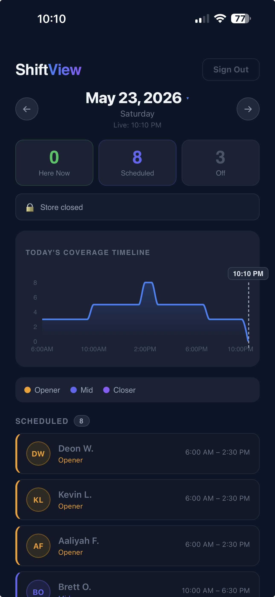

# ShiftView

A mobile-first shift dashboard for retail and hospitality managers — see who's in, who's next, and whether coverage is on track, all at a glance.

**[shiftview.app](https://shiftview.app)** · [Try the demo](https://shiftview.app?demo=true)




## Features

- **Live coverage status** — real-time indicator of whether staffing is optimal, low, or critical
- **Coverage timeline** — area chart showing staff count across the full operating day, with a pulsing now-indicator at the current time
- **Shift cards** — sorted list of scheduled employees with shift type (opener / mid / closer), times, and "Here" badge for who's currently on shift
- **Arrival countdown** — shows how long until the next employee's shift starts
- **Date navigation** — swipe or tap to browse past and future schedules
- **Pull to refresh** — drag down on mobile to fetch the latest data
- **Employee drawer** — tap any employee for a detail sheet with start/end times, shift type, and status
- **Manager controls** — edit shift times, mark an employee as off, or add an off employee back to the schedule
- **Dynamic store hours** — open and close times are stored per day in the database, not hardcoded
- **Demo mode** — try the app without an account at `/?demo=true`
- **Auth** — sign in via Supabase to view and manage live schedule data

## Tech Stack

| | |
|---|---|
| Framework | Next.js 16 (App Router) |
| Language | TypeScript |
| Styling | Tailwind CSS v4 |
| Database / Auth | Supabase |
| Charts | Recharts |
| Testing | Vitest + React Testing Library |

## Getting Started

### 1. Clone and install

```bash
git clone https://github.com/samuel-burke/shift-dashboard.git
cd shift-dashboard
npm install
```

### 2. Set environment variables

Create a `.env.local` file in the project root:

```env
NEXT_PUBLIC_SUPABASE_URL=your_supabase_project_url
NEXT_PUBLIC_SUPABASE_ANON_KEY=your_supabase_anon_key
```

### 3. Run the dev server

```bash
npm run dev
```

Open [http://localhost:3000](http://localhost:3000). To use demo mode without an account, visit [http://localhost:3000?demo=true](http://localhost:3000?demo=true).

> The live app is deployed at [shiftview.app](https://shiftview.app). Try the demo at [shiftview.app?demo=true](https://shiftview.app?demo=true).

## Running Tests

```bash
npm test          # single run
npm run test:watch  # watch mode
```

## Project Structure

```
app/
  api/
    employees/    # GET /api/employees
    me/           # GET /api/me — returns isManager flag for current user
    schedules/    # GET, POST, PUT, DELETE /api/schedules
    store-hours/  # GET /api/store-hours — per-day open/close times
  login/          # sign-in page
  page.tsx        # server entry, wraps pageClient in Suspense
  pageClient.tsx  # main dashboard client component
components/
  CoverageHeader.tsx    # date nav, stat cards, coverage alert
  CoverageTimeline.tsx  # recharts area chart with now-line overlay
  EmployeeDrawer.tsx    # bottom sheet for viewing and editing a shift
  ShiftCard.tsx         # individual employee row
  TeamSection.tsx       # grouped list of shift cards or off employees
data/
  types.ts        # shared types and pure utility functions
lib/
  supabase-browser.ts
  supabase-server.ts
```

## Database Schema

| Table | Columns |
|---|---|
| `employees` | `id`, `name`, `email`, `user_id` |
| `schedules` | `id`, `employee_id`, `date`, `start_minutes`, `end_minutes` |
| `store_hours` | `day_of_week` (0–6), `open_minutes`, `close_minutes` |
| `managers` | `user_id` |

Times are stored as minutes since midnight (e.g. `480` = 8:00 AM). Employees who are off on a given day have no row in `schedules` — they are derived by diffing the employee roster against that day's scheduled shifts.

> Demo mode (`?demo=true`) does not connect to Supabase at all — it uses static in-app fixtures from `data/demo-fixtures.ts`.

Row Level Security is enabled on all live tables. Managers can insert, update, and delete schedules; all authenticated users can read.

## Row Level Security

RLS is enabled on all live tables. The following policies are in effect:

| Table | Operation | Allowed |
|---|---|---|
| `employees` | SELECT | Authenticated users |
| `employees` | INSERT | Denied for all (managed via service role) |
| `employees` | UPDATE / DELETE | Users with a row in `managers` |
| `schedules` | SELECT | Authenticated users |
| `schedules` | INSERT / UPDATE / DELETE | Users with a row in `managers` |
| `managers` | SELECT | Authenticated users |
| `managers` | INSERT / UPDATE / DELETE | Denied for all (managed via service role) |
| `store_hours` | SELECT | All users (including unauthenticated) |
| `store_hours` | INSERT / UPDATE / DELETE | Users with a row in `managers` |
| `app_settings` | SELECT | All users (including unauthenticated) |
| `app_settings` | INSERT / UPDATE / DELETE | Users with a row in `managers` |

> Demo mode (`?demo=true`) does not connect to Supabase at all — no RLS policies apply.

**Notes**

- The `managers` table is intentionally write-protected via RLS. The application uses a service-role admin client (bypassing RLS) for all `managers` mutations after verifying manager status at the API layer.
- The `employees` INSERT path similarly uses the service-role admin client so the invite flow can create the employee row and send an auth invite atomically.
