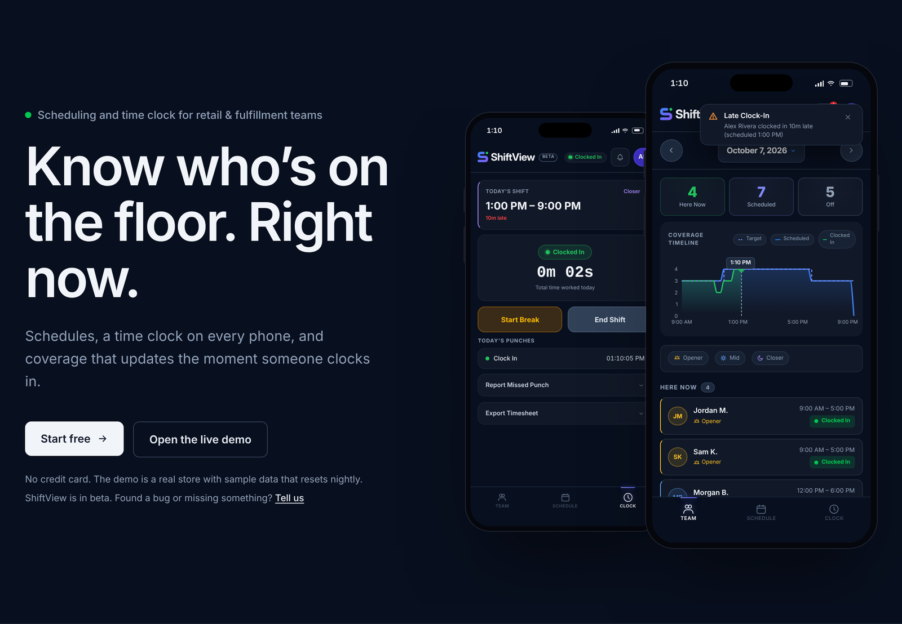
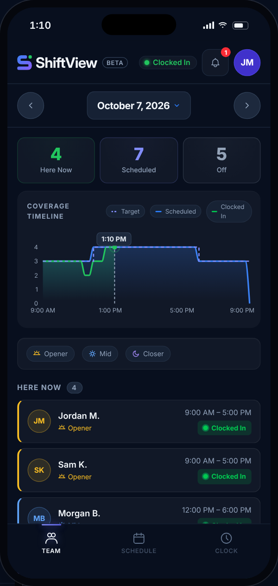
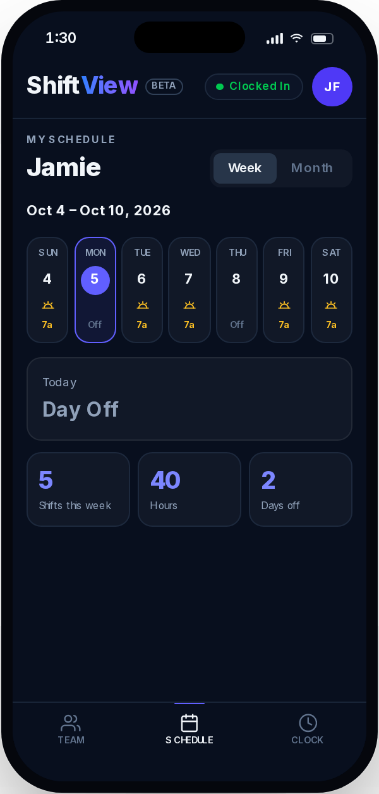
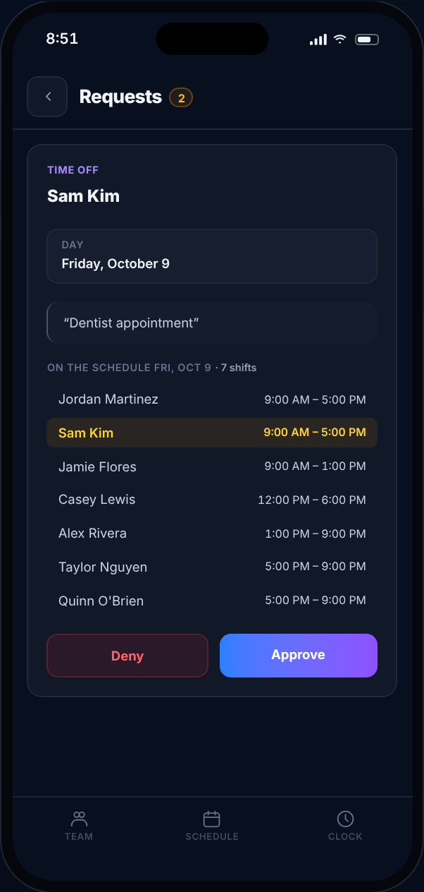
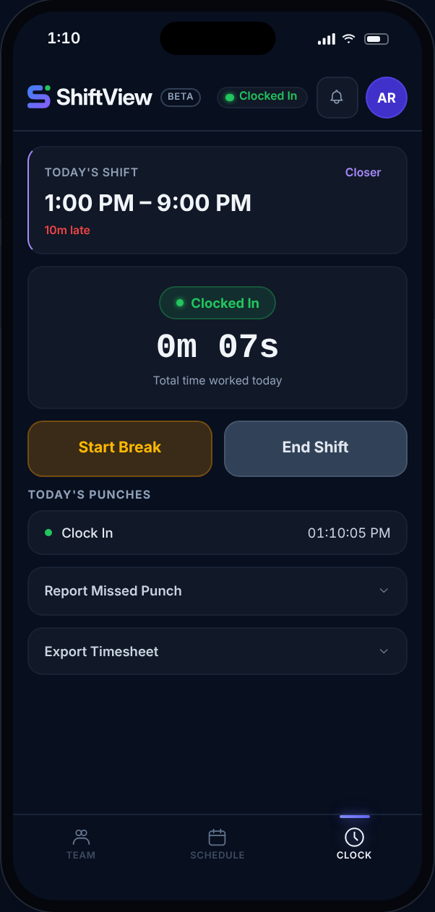
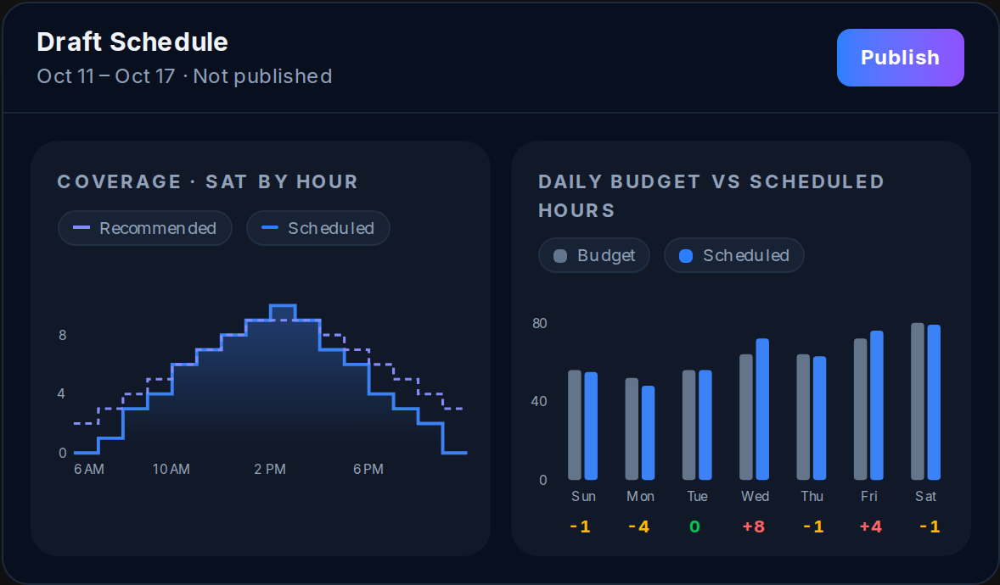

<h1 align="center">
  <picture>
    <source media="(prefers-color-scheme: light)" srcset="docs/brand/shiftview-logo-on-light.svg" />
    
  </picture>
</h1>

<p align="center">
  <strong>Scheduling, time clock and live coverage for retail &amp; fulfillment teams.</strong><br />
  A mobile-first, installable PWA for managers and the people on the floor.
</p>

<p align="center">
  <a href="https://shiftview.app"><strong>shiftview.app</strong></a> ·
  <a href="https://shiftview.app">Try the live demo</a> ·
  <a href="https://shiftview.app/product">Product tour</a> ·
  <a href="https://shiftview.app/contact">Contact</a>
</p>

<p align="center">
  <a href="https://github.com/samuel-burke/shiftview/actions/workflows/test.yml"></a>
  
  
  
</p>

<picture>
  <source media="(prefers-color-scheme: light)" srcset="docs/screenshots/hero-light.png" />
  
</picture>

### The app

Every screen below is the real UI rendered from the demo organization's seed data.

<table>
  <tr>
    <td align="center" width="25%">
      <picture>
        <source media="(prefers-color-scheme: light)" srcset="docs/screenshots/phone-team-light.png" />
        
      </picture>
      <br /><sub><b>Live coverage</b><br />Planned vs. clocked in, updated in real time</sub>
    </td>
    <td align="center" width="25%">
      <picture>
        <source media="(prefers-color-scheme: light)" srcset="docs/screenshots/phone-schedule-light.png" />
        
      </picture>
      <br /><sub><b>My schedule</b><br />The week at a glance, call-outs and swaps</sub>
    </td>
    <td align="center" width="25%">
      <picture>
        <source media="(prefers-color-scheme: light)" srcset="docs/screenshots/phone-requests-light.png" />
        
      </picture>
      <br /><sub><b>Approvals</b><br />Time off and two-step shift swaps</sub>
    </td>
    <td align="center" width="25%">
      <picture>
        <source media="(prefers-color-scheme: light)" srcset="docs/screenshots/phone-clock-light.png" />
        
      </picture>
      <br /><sub><b>Time clock</b><br />Geofenced punches and breaks</sub>
    </td>
  </tr>
</table>

<picture>
  <source media="(prefers-color-scheme: light)" srcset="docs/screenshots/planner-light.png" />
  
</picture>

<sub>Draft planning: staff to an hourly coverage target and a daily labor-hours budget before publishing.</sub>

## Features

**Coverage dashboard**
- Live coverage status (optimal / low / critical) computed from staff counts across store hours
- Coverage timeline chart with a pulsing now-indicator, arrival countdown for the next shift
- Shift cards with shift type (opener / mid / closer) and a "Here" badge for who's clocked in

**Scheduling**
- Week and month views with drag-free editing, reusable shift templates, and copy-week
- Employee availability tracking with conflict detection against time-off and availability when scheduling
- Shift swap requests with manager approval, and time-off requests with approval workflow; a request not approved by the time its day arrives is denied automatically
- Employee call-outs — one tap to report "I can't make it in" for a day; managers are notified instantly and the person shows as **Called Out** across the dashboard, schedule, and team status

**Time clock**
- Clock in/out with optional geofence enforcement (server-validated, not just client-side)
- Missed-punch detection and payroll-ready CSV exports

**Team**
- Direct messaging, encrypted at rest with AES-256-GCM
- Web push notifications with per-user preferences, plus in-app banners
- Email invites for onboarding, manager role management, and a full audit log of every mutation

**Platform**
- Installable PWA with service worker, offline-aware shell, and home-screen prompts
- Demo mode — one click signs you in anonymously to a seeded Demo organization with full read/write access; sample data resets nightly
- Nightly shift reminders for tomorrow's schedule via a Vercel cron job
- Public marketing site (`/`, `/product`, `/contact`) whose product previews are built from the real UI components and demo data, with a bot-protected contact form delivered via Resend

## Tech Stack

| | |
|---|---|
| Framework | Next.js 16 (App Router) |
| Language | TypeScript (strict) |
| Styling | Tailwind CSS v4 |
| Database / Auth / Realtime | Supabase |
| Charts | Recharts |
| Animation | Framer Motion |
| Push | Web Push (VAPID) |
| Unit tests | Vitest + React Testing Library |
| E2E tests | Playwright |
| CI / Hosting | GitHub Actions / Vercel |

## Architecture

```
Browser (React 19, PWA + service worker)
   │
   ├── Next.js route handlers (/app/api/*)   ← auth, validation, business rules
   │      │
   │      ├── Supabase (Postgres + RLS)      ← row-level security as defense in depth
   │      ├── Web Push (VAPID)               ← notifications
   │      └── Resend                         ← invite + reminder emails
   │
   └── Supabase Realtime                     ← live schedule/message updates
```

Key design decisions:

- **API routes as the single write path.** All mutations go through route handlers that check auth, verify manager status where required, validate input, and write an audit log entry. Row Level Security on every table acts as a second, independent enforcement layer — a bug in the API layer cannot expose more than RLS allows.
- **Times are minutes since midnight** (`480` = 8:00 AM). Shifts never cross midnight in this domain, so this avoids timezone and DST edge cases entirely; dates are plain `YYYY-MM-DD` strings.
- **"Off" is derived, not stored.** Employees with no schedule row for a date are off that day — computed by diffing the roster against the day's shifts, so there's no second source of truth to keep in sync.
- **Privileged operations use a service-role client.** Tables like `managers` and the employee-invite flow are write-denied via RLS for all users; the API performs those writes with the Supabase admin client only after verifying manager status itself.
- **Demo mode is a real tenant, not a mock layer.** "View Demo" signs the visitor in anonymously (`POST /api/demo/start`) as a manager of a seeded Demo organization, so demo traffic exercises the exact same routes, business logic, and RLS policies as production. A nightly cron resets and reseeds the data (see [docs/DEMO_ORG.md](docs/DEMO_ORG.md)).
- **Messages are encrypted at rest** with AES-256-GCM using a server-held key; the database never sees plaintext message content.

A full functional spec lives in [docs/REQUIREMENTS.md](docs/REQUIREMENTS.md), and data handling is documented in [PRIVACY_POLICY.md](PRIVACY_POLICY.md).

## Getting Started

### 1. Clone and install

```bash
git clone https://github.com/samuel-burke/shift-dashboard.git
cd shift-dashboard
npm install
```

### 2. Set environment variables

Create a `.env.local` file in the project root:

```env
NEXT_PUBLIC_SUPABASE_URL=your_supabase_project_url
NEXT_PUBLIC_SUPABASE_ANON_KEY=your_supabase_anon_key

# Message encryption — required for the messaging feature
MESSAGE_ENCRYPTION_KEY=your_64_char_hex_key
```

Generate a key with:

```bash
openssl rand -hex 32
```

> Keep this key secret and back it up securely. Messages are encrypted with AES-256-GCM before being stored in the database. If the key is lost, existing messages cannot be decrypted. When deploying (e.g. Vercel), set `MESSAGE_ENCRYPTION_KEY` as an environment variable in your project settings.

Optional variables enable additional features:

| Variable | Enables |
|---|---|
| `SUPABASE_SERVICE_ROLE_KEY` | Manager role management and the employee invite flow |
| `RESEND_API_KEY` | Invite, reminder and contact form emails (via Resend) |
| `CONTACT_TO_EMAIL` | Inbox that receives `/contact` form messages; the form returns 503 until set |
| `NEXT_PUBLIC_TURNSTILE_SITE_KEY` / `TURNSTILE_SECRET_KEY` | Cloudflare Turnstile bot check on demo start, signup and the contact form. Set both or neither (see [docs/CONTACT_FORM.md](docs/CONTACT_FORM.md)) |
| `VAPID_PUBLIC_KEY` / `VAPID_PRIVATE_KEY` / `VAPID_SUBJECT` | Web push notifications |
| `CRON_SECRET` | Nightly shift-reminder cron endpoint |
| `NEXT_PUBLIC_SITE_URL` | Absolute URLs in emails and auth redirects |

### 3. Run the dev server

```bash
npm run dev
```

Open [http://localhost:3000](http://localhost:3000). To explore without creating an account, click **View Demo** on the landing page (requires the demo org to be migrated and seeded — see [docs/DEMO_ORG.md](docs/DEMO_ORG.md)).

> The live app is deployed at [shiftview.app](https://shiftview.app).

## Testing & Quality

```bash
npm run lint        # ESLint
npm run typecheck   # tsc --noEmit
npm test            # Vitest unit/integration tests
npm run test:watch  # watch mode
npm run test:e2e    # Playwright e2e (APIs intercepted client-side, no backend needed)
```

API route handlers are tested directly against mocked Supabase clients, components with React Testing Library, and the core dashboard flows end-to-end with Playwright (all `/api/*` calls intercepted client-side; the web server runs with `E2E_BYPASS_AUTH=1`). CI runs lint, typecheck, unit, and e2e suites on every push and pull request.

## Project Structure

```
app/
  api/            # route handlers: schedules, swaps, time-off, callouts, punches,
                  # templates, messages, notifications, reports, invites, …
  clock/          # time clock (geofenced punch in/out)
  schedule/       # week/month schedule editor
  reports/        # payroll + coverage reports, CSV export
  settings/       # store hours, geofence, notifications, team management
  pageClient.tsx  # coverage dashboard (home)
components/       # UI components (one concern per file, co-located tests)
data/
  types.ts        # shared domain types + pure schedule/coverage utilities
  demo-fixtures.ts# seed-source data for the demo organization
lib/              # Supabase clients, encryption, audit log, web push, payroll
e2e/              # Playwright specs
docs/             # functional requirements spec
```

## Scheduled Tasks

`vercel.json` defines nightly crons, each protected by an `x-cron-secret` header (or Vercel's `Authorization: Bearer` header) checked against `CRON_SECRET`:

- `/api/cron/reminders` (22:00 UTC) sends each scheduled employee a push reminder of tomorrow's shift, honoring per-user notification preferences.
- `/api/cron/expire-requests` (10:00 UTC) denies time-off and shift-swap requests nobody approved before their day arrived (today or earlier in the store's timezone), noting each in the audit log. From the store's midnight the API already keeps such requests out of the inbox and refuses to approve them; the job records them as denied.
- `/api/cron/demo-reset` (08:00 UTC) resets and reseeds the demo organization (see [docs/DEMO_ORG.md](docs/DEMO_ORG.md)).

## Database Schema

| Table | Columns |
|---|---|
| `employees` | `id`, `name`, `email`, `user_id` |
| `schedules` | `id`, `employee_id`, `date`, `start_minutes`, `end_minutes` |
| `callouts` | `id`, `org_id`, `employee_id`, `date`, `reason`, `created_by`, `created_at` |
| `store_hours` | `day_of_week` (0–6), `open_minutes`, `close_minutes` |
| `managers` | `user_id` |

Times are stored as minutes since midnight (e.g. `480` = 8:00 AM). Employees who are off on a given day have no row in `schedules` — they are derived by diffing the employee roster against that day's scheduled shifts.

> The demo organization lives in these same tables as a regular tenant (flagged `organizations.is_demo`); `lib/demo-seed.ts` populates it from `data/demo-fixtures.ts`.

## Row Level Security

RLS is enabled on all live tables. The following policies are in effect:

| Table | Operation | Allowed |
|---|---|---|
| `employees` | SELECT | Authenticated users |
| `employees` | INSERT | Denied for all (managed via service role) |
| `employees` | UPDATE / DELETE | Users with a row in `managers` |
| `schedules` | SELECT | Authenticated users |
| `schedules` | INSERT / UPDATE / DELETE | Users with a row in `managers` |
| `callouts` | SELECT | Members of the row's organization |
| `callouts` | INSERT / UPDATE / DELETE | Members of the row's organization (the API additionally restricts writes to your own call-out, or a manager) |
| `managers` | SELECT | Authenticated users |
| `managers` | INSERT / UPDATE / DELETE | Denied for all (managed via service role) |
| `store_hours` | SELECT | All users (including unauthenticated) |
| `store_hours` | INSERT / UPDATE / DELETE | Users with a row in `managers` |
| `app_settings` | SELECT | All users (including unauthenticated) |
| `app_settings` | INSERT / UPDATE / DELETE | Users with a row in `managers` |

> The demo organization is isolated by the same org-scoped RLS policies as any other tenant; demo visitors are anonymous Supabase users with membership rows in the demo org.

**Notes**

- The `managers` table is intentionally write-protected via RLS. The application uses a service-role admin client (bypassing RLS) for all `managers` mutations after verifying manager status at the API layer.
- The `employees` INSERT path similarly uses the service-role admin client so the invite flow can create the employee row and send an auth invite atomically.
