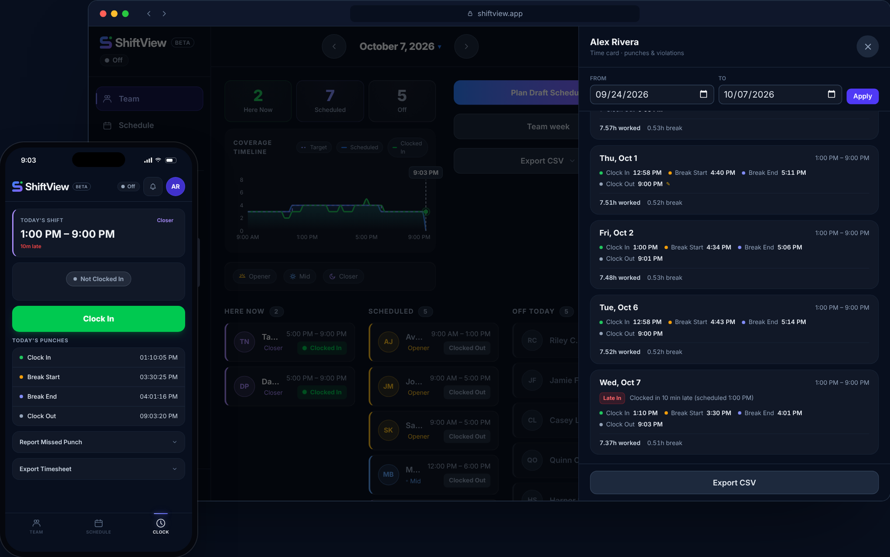
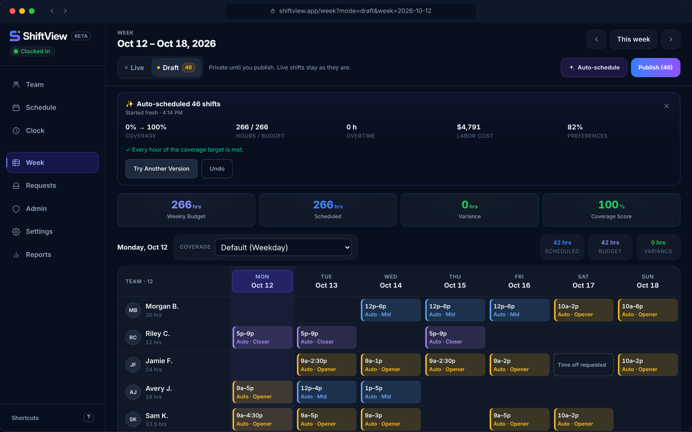
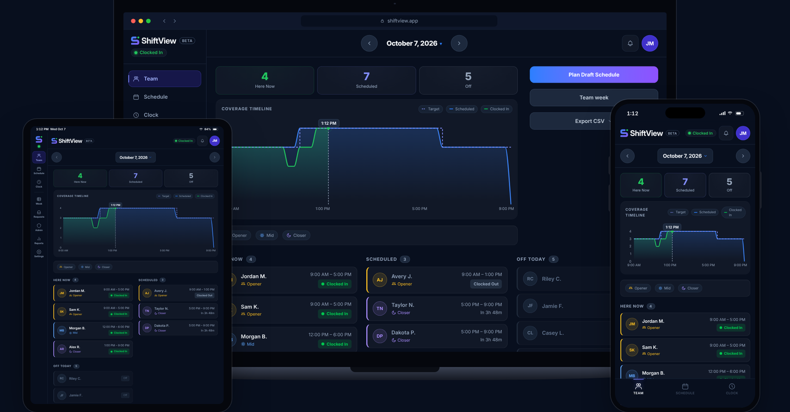

<h1 align="center">
  <picture>
    <source media="(prefers-color-scheme: light)" srcset="docs/brand/shiftview-logo-on-light.svg" />
    
  </picture>
</h1>

<p align="center">
  <strong>Scheduling, time clock and live coverage for retail &amp; fulfillment teams.</strong><br />
  A mobile-first, installable PWA for managers and the people on the floor.
</p>

<p align="center">
  <a href="https://shiftview.app"><strong>shiftview.app</strong></a> ·
  <a href="https://shiftview.app">Try the live demo</a> ·
  <a href="https://shiftview.app/#features">Features</a> ·
  <a href="https://shiftview.app/contact">Contact</a>
</p>

<p align="center">
  <a href="https://github.com/samuel-burke/shiftview/actions/workflows/test.yml"></a>
  
  
  
</p>

<picture>
  <source media="(prefers-color-scheme: light)" srcset="docs/screenshots/hero-light.png" />
  
</picture>

### The app

Every screen below is captured from the home page's product demos, which are built from the app's own components and the demo organization's seed data.

<table>
  <tr>
    <td align="center" valign="top" width="25%">
      <picture>
        <source media="(prefers-color-scheme: light)" srcset="docs/screenshots/phone-team-light.png" />
        
      </picture>
      <br /><sub><b>Live coverage</b><br />Planned vs. clocked in, updated in real time</sub>
    </td>
    <td align="center" valign="top" width="25%">
      <picture>
        <source media="(prefers-color-scheme: light)" srcset="docs/screenshots/phone-schedule-light.png" />
        
      </picture>
      <br /><sub><b>My schedule</b><br />The week at a glance, call-outs and swaps</sub>
    </td>
    <td align="center" valign="top" width="25%">
      <picture>
        <source media="(prefers-color-scheme: light)" srcset="docs/screenshots/phone-requests-light.png" />
        
      </picture>
      <br /><sub><b>Approvals</b><br />Time off and two-step shift swaps</sub>
    </td>
    <td align="center" valign="top" width="25%">
      <picture>
        <source media="(prefers-color-scheme: light)" srcset="docs/screenshots/phone-clock-light.png" />
        
      </picture>
      <br /><sub><b>Time clock</b><br />Geofenced punches and breaks</sub>
    </td>
  </tr>
</table>

<picture>
  <source media="(prefers-color-scheme: light)" srcset="docs/screenshots/time-card-light.png" />
  
</picture>

<sub>Time cards: every punch from the employee's phone lands on their time card, with hours, breaks and late punches flagged, ready to export for payroll.</sub>

<picture>
  <source media="(prefers-color-scheme: light)" srcset="docs/screenshots/auto-schedule-light.png" />
  
</picture>

<sub>Auto-schedule: next week drafted from the coverage targets, availability, time off and hour limits, ready to review and publish. This is a real run of the engine on the demo store.</sub>

<picture>
  <source media="(prefers-color-scheme: light)" srcset="docs/screenshots/devices-light.png" />
  
</picture>

<sub>Any device: one responsive layout per size class, from phones to desktop monitors.</sub>

## Features

**Coverage dashboard**
- Live coverage status (optimal / low / critical) comparing who's working with each day's coverage target
- Coverage timeline chart with a pulsing now-indicator, arrival countdown for the next shift
- Shift cards with shift type (opener / mid / closer) and a "Here" badge for who's clocked in

**Scheduling**
- Week and month views with drag-free editing, reusable shift templates, and copy-week
- Week page for managers — the whole team's week as a grid (a day list on phones) with a **Live | Draft** toggle. Live edits the published schedule. Draft plans privately on top of it, with a budget-vs-scheduled chart, an hour-by-hour heatmap and each person's hours showing the week as it will be after publishing, then publishes in one step
- Employee availability tracking with conflict detection against time-off and availability when scheduling
- Shift swaps in two steps (the coworker accepts, then a manager approves), and time-off requests with approval workflow
- Open shifts — managers post an uncovered slot, eligible employees claim it, and approving a claim puts the shift on the schedule
- Overnight shifts (a shift belongs to the day it starts) and per-shift positions such as Cashier or Floor
- Employee call-outs — one tap to report "I can't make it in" for a day; managers are notified instantly and the person shows as **Called Out** across the dashboard, schedule, and team status
- Auto-schedule — one tap in the Week page's Draft mode drafts the week from the coverage targets, availability, time off, full-time/part-time hours, overtime rules and shift preferences, and explains any gap it couldn't fill; try another version, apply a one-tap fix or undo before publishing. Runs on ShiftView's own deterministic optimization engine, with no chatbot or third-party AI ([docs/AUTO_SCHEDULER.md](docs/AUTO_SCHEDULER.md))

**Time clock**
- Clock in/out with optional geofence enforcement (server-validated, not just client-side)
- Missed-punch detection; employees request corrections and a manager approves them before they count
- Time cards, payroll-ready CSV exports, and labor cost, punctuality and scheduled-hours reports

**Team**
- Direct messaging, encrypted at rest with AES-256-GCM, and team announcements from managers
- Web push notifications with per-user preferences, plus in-app banners
- Email invites for onboarding (someone who already has an account is added directly), manager role management, and a full audit log of every mutation
- One account across several stores, with an organization switcher in the user menu

**Platform**
- Installable PWA with service worker, offline-aware shell, and home-screen prompts
- Demo mode — one click signs you in anonymously to a seeded Demo organization with full read/write access; sample data resets nightly
- Nightly shift reminders for tomorrow's schedule via a Vercel cron job, and a calendar (.ics) export of your shifts
- Public marketing site (`/` and `/contact`) whose product demos run on the app's own UI components and the demo store's data, including a real Auto-schedule run (`components/marketing/`), with a bot-protected contact form delivered via Resend

## Tech Stack

| | |
|---|---|
| Framework | Next.js 16 (App Router) |
| Language | TypeScript (strict) |
| Styling | Tailwind CSS v4 |
| Database / Auth / Realtime | Supabase |
| Charts | Recharts |
| Animation | Framer Motion |
| Push | Web Push (VAPID) |
| Unit tests | Vitest + React Testing Library |
| E2E tests | Playwright |
| CI / Hosting | GitHub Actions / Vercel |

## Architecture

```
Browser (React 19, PWA + service worker)
   │
   ├── Next.js route handlers (/app/api/*)   ← auth, validation, business rules
   │      │
   │      ├── Supabase Postgres + RLS        ← row-level security as defense in depth
   │      ├── Supabase Auth                  ← email sign-in codes, invites, anonymous demo sessions
   │      ├── Web Push (VAPID)               ← notifications
   │      └── Resend                         ← contact form + low-coverage alert emails
   │
   └── Supabase Realtime                     ← live schedule/message updates
```

Key design decisions:

- **API routes as the single write path.** All mutations go through route handlers that check auth, verify manager status where required, validate input, and write an audit log entry. Row Level Security enforces the same tenant and role boundaries a second time: the browser holds the anon key and the user's session, so a request that skips the API and calls Supabase directly still can't do more than the API allows.
- **Every tenant row carries `org_id`.** Route handlers take the organization from `getOrgContext()` / `requireManager()`, which only ever picks among the caller's own memberships (the organization switcher's cookie says which), and scope every query by it. Composite foreign keys keep a child row in its parent's organization (see [docs/MULTI_TENANCY.md](docs/MULTI_TENANCY.md)).
- **Times are minutes since midnight** (`480` = 8:00 AM), and a shift belongs to the date it starts on. An overnight shift ends past `1440` (10 PM–6 AM is `1320`–`1800`), up to 16 hours long. Dates are plain `YYYY-MM-DD` strings in the store's timezone (`app_settings.timezone`), so the browser's timezone never decides what "today" is.
- **"Off" is derived, not stored.** Employees with no schedule row for a date are off that day — computed by diffing the roster against the day's shifts, so there's no second source of truth to keep in sync.
- **Privileged operations use a service-role client.** Nobody writes the `managers` table directly: roles change through the `manager_promote` / `manager_demote` database functions, and invites, sign-up, the demo, cron jobs, notifications and the audit log write through the Supabase admin client after the API has checked the caller.
- **Demo mode is a real tenant, not a mock layer.** The demo button signs the visitor in anonymously (`POST /api/demo/start`) as a manager of a seeded Demo organization, so demo traffic exercises the exact same routes, business logic, and RLS policies as production. A nightly cron resets and reseeds the data (see [docs/DEMO_ORG.md](docs/DEMO_ORG.md)).
- **Message bodies are encrypted at rest** with AES-256-GCM using a server-held key, so the `messages` table only ever holds ciphertext. The new-message notification (in-app and push) carries the text as a preview, and that `notifications` row is not encrypted.

A full functional spec lives in [docs/REQUIREMENTS.md](docs/REQUIREMENTS.md), and data handling is documented in [PRIVACY_POLICY.md](PRIVACY_POLICY.md).

## Getting Started

You need Node.js 22 (the version CI uses) and a [Supabase](https://supabase.com) project.

### 1. Clone and install

```bash
git clone https://github.com/samuel-burke/shiftview.git
cd shiftview
npm install
```

### 2. Set environment variables

Create a `.env.local` file in the project root:

```env
NEXT_PUBLIC_SUPABASE_URL=your_supabase_project_url
NEXT_PUBLIC_SUPABASE_ANON_KEY=your_supabase_anon_key

# Server-only: never give it a NEXT_PUBLIC_ prefix
SUPABASE_SERVICE_ROLE_KEY=your_supabase_service_role_key

# Message encryption — required for the messaging feature
MESSAGE_ENCRYPTION_KEY=your_64_char_hex_key
```

All four are required. The service role key is used on the server for notifications, the audit log, sign-up, invites, the demo, cron jobs and account deletion; without it those fail. It bypasses Row Level Security, so keep it out of the browser and out of git.

Generate the message encryption key with:

```bash
openssl rand -hex 32
```

> Keep this key secret and back it up securely. Messages are encrypted with AES-256-GCM before being stored in the database. If the key is lost, existing messages cannot be decrypted. When deploying (e.g. Vercel), set `MESSAGE_ENCRYPTION_KEY` as an environment variable in your project settings.

Optional variables enable additional features:

| Variable | Enables |
|---|---|
| `NEXT_PUBLIC_SITE_URL` | The app's public URL (e.g. `https://shiftview.app`). Invite emails link back to `<site>/auth/callback`, so set it before inviting anyone |
| `RESEND_API_KEY` | Contact form and low-coverage alert emails (via Resend). Invite emails come from Supabase Auth |
| `CONTACT_TO_EMAIL` | Inbox that receives `/contact` form messages; the form returns 503 until this and `RESEND_API_KEY` are set |
| `NEXT_PUBLIC_TURNSTILE_SITE_KEY` / `TURNSTILE_SECRET_KEY` | Cloudflare Turnstile bot check on demo start, signup and the contact form. Set both or neither (see [docs/CONTACT_FORM.md](docs/CONTACT_FORM.md)) |
| `VAPID_PUBLIC_KEY` / `VAPID_PRIVATE_KEY` | Web push notifications. Generate a pair with `npx web-push generate-vapid-keys` |
| `VAPID_SUBJECT` | Contact address sent to push services; defaults to `mailto:noreply@shiftview.app` |
| `CRON_SECRET` | The two cron endpoints (shift reminders and the demo reset); they return 401 until it's set |

`NEXT_PUBLIC_*` values are inlined at build time, so rebuild or redeploy after changing them.

### 3. Set up the database

**New Supabase project**

1. Enable **Authentication → Sign In / Up → Allow anonymous sign-ins**. The demo needs it.
2. In the SQL editor, run `supabase/baseline.sql`. It creates the whole schema as of migration `0037` (tables, functions, triggers, RLS policies, Realtime) and the default and demo organizations.
3. Run every migration numbered after `0037` (`0038_*` onward), in filename order.

**Existing database**

Apply the numbered migrations you haven't run yet, in filename order. Don't run the baseline. The full order is `supabase/migrations/0001` to `0004`, then `db/migrations/2026-06-10-draft-schedules.sql` and `db/migrations/2026-06-10-coverage-profiles.sql`, then `supabase/migrations/0005` onward. Both `0009_*` files are needed; `0017`, `0018` and `0021`–`0025` don't exist.

A migration whose header says **DEPLOY THE APP FIRST** (`0038`, `0042`) needs the app code from its branch live before it runs; the others work with the code from before them.

The numbered migrations upgrade ShiftView's original single-tenant schema, which predates this repository and was never checked in, so on their own they can't build a database from nothing. `baseline.sql` was generated from production and is checked against it: applied to an empty database, its tables, constraints, indexes, functions, function privileges, triggers, policies and Realtime tables match production's catalog. `supabase/manual-tests/baseline.test.sql` builds a database the way the steps above do and runs sign-up, invites, cross-organization isolation, the time clock and the RPC lockdown against it. `supabase db push` can't apply the folder as-is: two files share version `0009`.

### 4. Run the dev server

```bash
npm run dev
```

Open [http://localhost:3000](http://localhost:3000). To explore without creating an account, click **Open the live demo** on the landing page. The first demo visit seeds the Demo organization; this needs anonymous sign-ins, `SUPABASE_SERVICE_ROLE_KEY` and migration `0006` (see [docs/DEMO_ORG.md](docs/DEMO_ORG.md)). Signing up at `/signup` creates your own organization with you as its owner.

> The live app is deployed at [shiftview.app](https://shiftview.app).

## Testing & Quality

```bash
npm run lint        # ESLint
npm run typecheck   # tsc --noEmit
npm test            # Vitest unit/integration tests
npm run test:watch  # watch mode
npx playwright install chromium   # once, before the first e2e run
npm run test:e2e    # Playwright e2e (APIs intercepted client-side, no backend needed)
npm run build       # production build
```

API route handlers are tested directly against mocked Supabase clients, components with React Testing Library, and the core dashboard flows end-to-end with Playwright (all `/api/*` calls intercepted client-side; the web server runs with `E2E_BYPASS_AUTH=1`). Database triggers and policies have behavioural SQL tests in `supabase/manual-tests/`, run by hand against a throwaway Postgres (instructions at the top of each file). CI runs lint, typecheck, the unit suite (also under two far-off timezones), and the e2e suite on pushes to `main` and `dev` and on every pull request.

## Project Structure

```
app/
  api/              # route handlers (see API Routes)
  page.tsx          # landing page when signed out, coverage dashboard when signed in
  pageClient.tsx    # coverage dashboard
  schedule/         # my schedule: week/month views, call-outs, swaps, time off
  clock/            # time clock (geofenced punch in/out)
  week/             # manager Week page: Live and Draft modes, Auto-schedule
  requests/         # manager inbox: time off, swaps, open shifts, punch corrections
  reports/          # payroll, labor cost, punctuality and coverage reports, CSV export
  coverage/         # coverage target profiles
  admin/            # manager roles
  settings/         # store hours, geofence, notifications, team management
  login/ signup/ contact/ privacy/ auth/callback/
components/         # UI components (one concern per file, co-located tests)
  marketing/        # the home page's product demos
hooks/              # shared React hooks
data/
  types.ts          # shared domain types + pure schedule/coverage utilities
  demo-fixtures.ts  # seed-source data for the demo organization
lib/                # Supabase clients, org scoping, encryption, audit log, web push, payroll
  scheduler/        # Auto-schedule engine (pure TypeScript, no I/O)
supabase/
  baseline.sql      # whole schema as of 0037, for new projects (see Set up the database)
  migrations/       # SQL migrations
  manual-tests/     # behavioural SQL tests for the baseline, triggers and policies
db/migrations/      # two earlier migrations, run between 0004 and 0005
e2e/                # Playwright specs
docs/               # requirements spec and design notes: multi-tenancy, demo org, auto-scheduler, contact form
proxy.ts            # Next.js proxy: refreshes the Supabase session, sends signed-out visitors to /login
```

## API Routes

Routes that touch organization data resolve the caller's organization on the server, never from the request. Access levels: **public** needs no session; **signed in** needs a session but no organization; **member** is anyone in the organization; **own** means employees act on their own records; **manager** is checked with `requireManager()`.

**Account and organization**

| Route | Methods | Access |
|---|---|---|
| `/api/me` | GET | Member (a blank identity when signed out); includes every organization you belong to |
| `/api/me/organization` | POST | Signed in: switch to another of your organizations (stored in the `sv_org` cookie) |
| `/api/organizations` | POST, DELETE | POST: signed in with an email (not a demo session) creates an org; DELETE: the owner |
| `/api/account` | DELETE | Signed in (deletes your own account) |
| `/api/auth/signup-otp` | POST | Public, Turnstile-gated |
| `/api/demo/start` | POST | Public, Turnstile-gated |
| `/api/employees` | GET, PATCH, DELETE | GET: member (pay rates for managers only); PATCH, DELETE: manager |
| `/api/invites` | POST, PUT | Manager |
| `/api/managers`, `/api/managers/[userId]` | GET, PUT | Manager (only the owner changes roles in an owned org) |
| `/api/audit-log` | GET | Manager |

**Scheduling**

| Route | Methods | Access |
|---|---|---|
| `/api/schedules` | GET, POST, PUT, DELETE | GET: member; writes: manager |
| `/api/schedules/copy`, `/api/schedules/position` | POST, PUT | Manager |
| `/api/my-schedule`, `/api/my-schedule/calendar` | GET | Own (the calendar is an `.ics` file) |
| `/api/templates`, `/api/templates/[id]`, `/api/templates/[id]/apply` | GET, POST, DELETE | Manager |
| `/api/drafts`, `/api/drafts/publish` | GET, POST, PUT, DELETE | Manager |
| `/api/drafts/generate`, `/api/drafts/generate/undo` | GET, POST | Manager (Auto-schedule) |
| `/api/store-hours`, `/api/settings` | GET, PUT | GET: member; PUT: manager |
| `/api/coverage-profiles`, `/api/coverage-assignments` | GET, POST, PUT, DELETE | GET: member; writes: manager |
| `/api/positions` | GET, POST, DELETE | GET: member; writes: manager |
| `/api/availability` | GET, POST, DELETE | GET: member; writes: own or manager |
| `/api/preferences` | GET, PUT | Own or manager |

**Requests**

| Route | Methods | Access |
|---|---|---|
| `/api/time-off` | GET, POST | GET: own (managers see all); POST: own |
| `/api/time-off/[id]` | PUT | Manager (approve or deny) |
| `/api/swaps` | GET, POST | GET: own (managers see all); POST: own shift |
| `/api/swaps/[id]` | PUT | The asked coworker accepts or declines; a manager approves or denies |
| `/api/callouts` | GET, POST | GET: member (reasons for the caller and managers only); POST: own |
| `/api/callouts/[id]` | DELETE | Own or manager |
| `/api/open-shifts` | GET, POST | GET: member; POST: manager |
| `/api/open-shifts/[id]` | PUT | Manager |
| `/api/open-shifts/[id]/claim` | POST | Own |
| `/api/punch-corrections` | GET | Own (managers see all) |
| `/api/punch-corrections/[id]` | PUT | Manager (approve or deny) |

**Time clock and reports**

| Route | Methods | Access |
|---|---|---|
| `/api/punches` | GET, POST, PUT | GET: own (managers see all); POST: own live punch; PUT: managers edit, employees file a correction |
| `/api/punches/current`, `/api/punches/missed` | GET | Own |
| `/api/punches/export` | GET | Own (managers see all) |
| `/api/timecard` | GET | Manager |
| `/api/reports/payroll`, `/api/reports/payroll/export`, `/api/reports/labor-cost`, `/api/reports/punctuality`, `/api/reports/coverage`, `/api/reports/scheduled-hours` | GET | Manager |
| `/api/reports/anniversaries` | GET, PUT | Manager |

**Messaging and notifications**

| Route | Methods | Access |
|---|---|---|
| `/api/messages` | GET, POST, PATCH | Member (your own conversations) |
| `/api/announcements` | GET, POST, DELETE | GET: member; writes: manager |
| `/api/notifications` | GET, PATCH, DELETE | Own (managers also get org-wide alerts) |
| `/api/notify-employee` | POST | Manager |
| `/api/notification-preferences` | GET, PUT | Signed in |
| `/api/push/subscribe` | POST, DELETE | Signed in (not demo sessions) |
| `/api/push/vapid-key` | GET | Public |
| `/api/presence` | POST | Signed in |
| `/api/contact` | POST | Public, rate-limited, Turnstile-gated |

**Cron**

| Route | Methods | Access |
|---|---|---|
| `/api/cron/reminders`, `/api/cron/demo-reset` | GET | `CRON_SECRET` (see Scheduled Tasks) |

## Scheduled Tasks

`vercel.json` schedules two cron jobs:

| Path | Schedule (UTC) | What it does |
|---|---|---|
| `/api/cron/reminders` | 22:00 daily | Notifies each employee scheduled tomorrow (in their store's timezone), honoring their notification preferences. Skips demo organizations |
| `/api/cron/demo-reset` | 08:00 daily | Wipes and reseeds the demo organization and deletes the anonymous users of past demo sessions |

Both require `CRON_SECRET`. Vercel sends it as `Authorization: Bearer <CRON_SECRET>`; for a manual run, send it in an `x-cron-secret` header:

```bash
curl -H "x-cron-secret: $CRON_SECRET" https://<your-site>/api/cron/demo-reset
```

## Database Schema

Every tenant table has an `org_id` referencing `organizations`, and child rows reference their parents by `(id, org_id)` so they can't point into another organization. The main tables and columns:

| Table | Columns |
|---|---|
| `organizations` | `id`, `name`, `slug`, `is_demo`, `created_at` |
| `managers` | `org_id`, `user_id`, `is_owner` |
| `employees` | `id`, `org_id`, `name`, `email`, `user_id`, `pay_rate`, `hire_date`, `employment_type`, `min_weekly_hours`, `max_weekly_hours`, `max_days_per_week` |
| `schedules` | `id`, `org_id`, `employee_id`, `date`, `start_minutes`, `end_minutes`, `position_id` |
| `draft_schedules` | `id`, `org_id`, `employee_id`, `date`, `start_minutes`, `end_minutes`, `generation_run_id` |
| `schedule_templates` / `schedule_template_rows` | `id`, `org_id`, `name` / `template_id`, `employee_id`, `day_of_week`, `start_minutes`, `end_minutes` |
| `store_hours` | `org_id`, `day_of_week` (0–6), `open_minutes`, `close_minutes` |
| `app_settings` | `org_id`, `key`, `value` (timezone, geofence, punch and scheduling rules) |
| `positions` | `id`, `org_id`, `name`, `color` |
| `coverage_profiles` / `coverage_profile_blocks` | `id`, `org_id`, `name` / `profile_id`, `start_minutes`, `end_minutes`, `headcount` |
| `coverage_day_defaults` / `coverage_date_overrides` | `org_id`, `day_of_week` or `date`, `profile_id` |
| `availability` | `id`, `org_id`, `employee_id`, `day_of_week`, `start_minutes`, `end_minutes`, `note` |
| `employee_preferences` | `org_id`, `employee_id`, `preferred_shift_types`, `preferred_days`, `avoid_days`, `desired_weekly_hours`, `note`, `updated_at` |
| `time_off_requests` | `id`, `org_id`, `employee_id`, `date`, `status`, `note` |
| `callouts` | `id`, `org_id`, `employee_id`, `date`, `reason`, `created_by`, `created_at` |
| `shift_swaps` | `id`, `org_id`, `requester_id`, `target_id`, `schedule_a_id`, `schedule_b_id`, `status` (pending → accepted → approved, or declined / denied), `created_at` |
| `open_shifts` / `open_shift_claims` | `id`, `org_id`, `date`, `start_minutes`, `end_minutes`, `note`, `status`, `filled_by`, `filled_at` / `open_shift_id`, `employee_id`, `status` |
| `punch_records` | `id`, `org_id`, `employee_id`, `schedule_id`, `punch_type`, `punched_at`, `is_manual`, `note`, `lat`, `lng` |
| `punch_corrections` | `id`, `org_id`, `employee_id`, `punch_type`, `punched_at`, `note`, `status`, `requested_by`, `reviewed_by`, `reviewed_at`, `review_note`, `punch_id` |
| `schedule_generation_runs` | `id`, `org_id`, `week_start`, `mode`, `seed`, `rules`, `adjustments`, `metrics`, `previous_drafts`, `created_by`, `created_at`, `undone_at`, `published_at` |
| `messages` | `id`, `org_id`, `conversation_id`, `from_user_id`, `to_user_id`, `body` (encrypted), `read`, `created_at` |
| `announcements` | `id`, `org_id`, `title`, `body`, `created_by`, `created_at` |
| `notifications` | `id`, `org_id`, `user_id` (null for an alert to all managers), `type`, `title`, `body`, `data`, `read`, `is_cleared`, `created_at` |
| `audit_logs` | `id`, `org_id`, `actor_id`, `action`, `resource_type`, `resource_id`, `before`, `after`, `metadata`, `created_at` |
| `push_subscriptions`, `user_notification_preferences`, `device_presence` | Per user, not per organization |

Times are stored as minutes since midnight (e.g. `480` = 8:00 AM); an overnight shift's `end_minutes` passes `1440`. Employees who are off on a given day have no row in `schedules` — they are derived by diffing the employee roster against that day's scheduled shifts.

> The demo organization lives in these same tables as a regular tenant (flagged `organizations.is_demo`); `lib/demo-seed.ts` populates it from `data/demo-fixtures.ts`.

## Row Level Security

RLS is enabled on every tenant table. Policies apply to signed-in users (`authenticated`, which includes anonymous demo sessions) and compare each row with three sets looked up once per query: `my_org_ids()` (orgs where you have a `managers` or `employees` row), `my_managed_org_ids()` (orgs you manage) and `my_employees()` (the `(org_id, employee_id)` rows linked to your account), as in `org_id in (select my_org_ids())`. Calling a function per row instead (the older `is_org_member(org)` style) was 12–35× slower in a benchmark on 50,000 shifts. With migrations through `0042` applied:

| Table | Read | Write |
|---|---|---|
| `organizations` | Members | Service role only (sign-up runs `org_signup_create`) |
| `employees` | Members, every column except `pay_rate`; managers read pay rates through `employee_pay_rates(org)` | Managers. An end user can link an employee row only to their own account |
| `managers` | Members | No direct writes: `manager_promote` / `manager_demote` (the owner, when the org has one; members only), sign-up and the service role |
| `schedules`, `store_hours`, `app_settings`, `schedule_templates`, `schedule_template_rows`, `positions`, `announcements`, `open_shifts`, coverage tables | Members | Managers |
| `draft_schedules` | Managers | Managers |
| `availability`, `callouts` | Members | Your own rows, or managers |
| `time_off_requests` | Members | Employees file their own as pending; managers decide, edit and delete |
| `shift_swaps` | Members | The requester files a pending swap of their own shift for the coworker's; the asked coworker can only accept or decline it; managers decide and delete. `approve_shift_swap` refuses (`stale`) if either shift changed hands since |
| `open_shift_claims` | Members | Your own claims, as pending; managers decide |
| `punch_records` | Your own punches, or managers | Employees add their own live punches, stamped with the database clock and checked against their last punch; managers add, edit and delete |
| `punch_corrections` | Your own, or managers | Employees file their own as pending; managers review and delete |
| `employee_preferences` | Your own, or managers | Your own, or managers |
| `schedule_generation_runs` | Managers | Written by `apply_generated_drafts` / `undo_generation_run`; managers mark them published |
| `messages` | Sender and recipient | Send as yourself (`conversation_id` must match the pair); the recipient marks them read, nothing else |
| `notifications` | Your own, plus org-wide alerts for managers | Created through the `notify_*` functions (service role); you mark your own read or cleared |
| `audit_logs` | Managers, their own org | Service role only |
| `device_presence` | Your own devices | Your own devices |

> The demo organization is isolated by the same org-scoped RLS policies as any other tenant; demo visitors are anonymous Supabase users with membership rows in the demo org.

**Notes**

- The `SECURITY DEFINER` functions the app calls bypass RLS, so each either checks the caller itself (`approve_shift_swap`, `apply_generated_drafts`, `undo_generation_run`, `manager_promote`, `manager_demote`, `employee_pay_rates`; `presence_set` only writes the caller's own device; `my_*` only return the caller's own memberships) or can only be called with the service role (`notify_*`, `link_employee_account`, `org_signup_create`, `org_delete`, `reset_demo_org`). Trigger functions and the old `is_org_*` helpers can't be called through the API at all.
- API roles can't select `employees.pay_rate` (`0042` grants the other columns one by one). A column added to `employees` later isn't readable through the API until it's added to that grant.
- `anon` can't write any table, and only the service role can `TRUNCATE` (which skips RLS).
- The service-role admin client bypasses RLS entirely, so every query made with it filters on `org_id` explicitly.
- `push_subscriptions`, `user_notification_preferences` and `device_presence` are per user: you read and write only your own rows.
